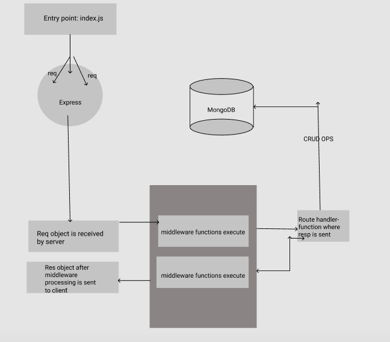

# api-server
## Lab-06

**Author: Riva Davidowski**

#### This app is all about building a dynamic API

**Phase 1 Requirements:**

- Build a simple API (with no code) to gain some clarity and visuals on proper route structure and the data contracts.
- Use ‘json-server’ to build a simple API server that fulfills all of our business requirements in a “sandbox”
- Specifically, I will be building an API to serve data for a virtual storefront, which displays categories and products to a potential shopper

*For the first phase, this API will perform CRUD operations using ReST methods on 2 data models using json-server, an installable and configurable API application used to “spin up” servers for testing purposes.*

**Phase 2 Requirements:**

- Previously,  json-server did a great job of serving as a “mock” API server for our application. In this phase , I begin the transition towards making a “real” API server. Specifically, replicating the same functionality json-server provided is done by writing my own server, using Express and Node.js

**Phase 3 Requirements**

In this phase, I continue the transition towards making a “real” API server.
- Migrate from in-memory data storage to using Mongo to store the data permanently, and modularizing routes for flexibility.

Dynamic API Phase 4: Completing work on the API server

In this final phase, I'll be making the API easier to manage, and much more extensible, allowing for it to automatically recognize new data models, backed by any database type. I'll also be preparing it for delivery with a full suite of documentation, tests, and a permanent deployment

**2 primary goals:**

- Create a single router module that will work for any data model, rather than having separate router modules for every data module.
- Create a single “mongo” collection class that every data model can extend from, keeping the CRUD logic for our models very DRY


## Setup

### How to initialize/run the application:
**The following software is required to be installed on your system:**

- Install npm: `npm i -g` and then use  `npm init`
- Install json-server: `npm install json-server`
    - Create a `db.json` file with some data
    - Start JSON Server: `json-server --watch db.json`
    - Note that json-server does not validate your data, it’ll just save whatever you send it.
    - Visit [npmjs.com](https://www.npmjs.com/package/json-server) for more info
- Use httpie (command line), Insomnia, Postman, or any other “ReST” testing application to POST some categories and products, using JSON, into your API so you have data to work with.
- install `express`
- import express : `const express = require('express');
- Execute express: `const app = express();`

- **The entry point for this app is: `index.js`**
- Start server:
```
    /* give it a port number and optionally pass a function to call when app
     starts listening on given port*/

const port = process.env.PORT || 3000;
app.listen(port, () => console.log(`Listening on port ${port}`));

```

- Install MongoDB: `npm install mongodb`
- Install mongoose: `npm install -save--dev mongoose`
- Visit [docs.mongodb.com](https://docs.mongodb.com/manual/tutorial/getting-started/) to learn How to get started using MongoDB.
- Connect to your db:

```

//Connect to Database
mongoose.connect(process.env.MONGODB_URI,{useNewUrlParser:true, useUnifiedTopology: true} )
    .then(() => console.log('Connected to MongoDB...'))
    .catch(err => console.error('Could not connect to MongoDB...',err));

```

### ,env requirements:

```
PORT=4000
MONGODB_URI=

```

### Testing:

**Phase 1:**

- Create an account at swagger.io and used the Inspector application to test api
- Wrote and published swagger documentation with Swagger Inspector, this published it to Swagger Hub
- Converted the `YAML` to `JSON` and then copied and pasted swagger.json from the editor and add to your server project.

**Phase 2:**

- install `supertest`: `npm install supertest`
- install `jest`: `npm install jest`
- install `supergoose`

**Phase 3:**

- Unit tests for  middleware
- Route tests for  server
- Every route should respond with the right status code and the expected data
- CRUD tests for  collection classes
- Used the `supergoose` testing library to ensure that data is persisted into a live database and that the server need not be started.




